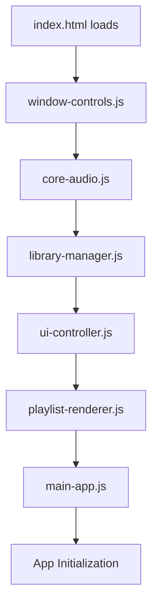
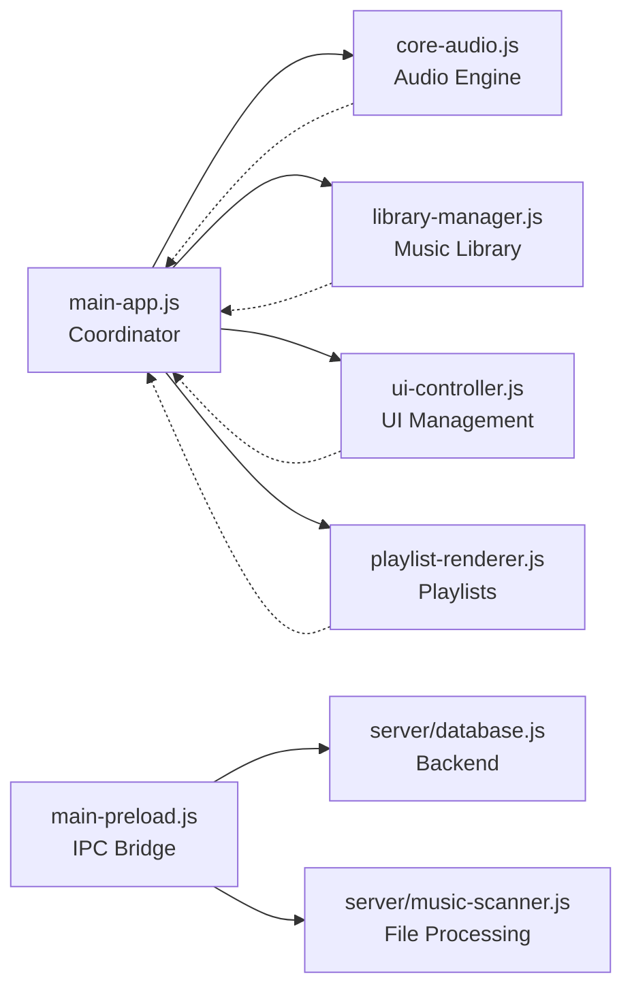

# 🏗️ Que-Music Application Architecture & Execution Flow

**Last Verified**: 2026-09-14 (script load order and startup command checked against `index.html`/`package.json`)  
**Author**: Erich Quade

## Overview

This document provides a comprehensive understanding of how Que-Music starts up and executes, from the initial HTML load through the complete application lifecycle.

---

## 🚀 Application Startup Sequence

### 1. Electron Main Process (main.js)

**File**: `main.js` (root directory)
**Executed By**: Electron when the app starts

```
npm start → node start-electron.js → electron main.js
```

(`start-electron.js` is a thin wrapper that strips `ELECTRON_RUN_AS_NODE` before spawning Electron — see `docs/application/electron-startup-troubleshooting.md`. The project packages with Electron Builder, not Electron Forge — see `docs/application/packaging-guide.md`.)

**Main Process Responsibilities:**

- Creates the main browser window with security configurations
- Sets up comprehensive IPC (Inter-Process Communication) handlers
- Initializes SQLite database connection with better-sqlite3
- Manages file system operations and music scanning
- Sets up security policies and window management
- Handles application lifecycle events and menu creation

### 2. Preload Script Injection

**File**: `client/scripts/main-preload.js`
**Executed By**: Electron before the renderer process loads

**Purpose**: Creates secure bridge between main and renderer processes

- Exposes `window.queMusicAPI` object
- Provides safe IPC communication methods
- Sets up all API endpoints for the frontend

### 3. HTML Document Load

**File**: `client/pages/index.html`
**Executed By**: Electron renderer process

**Load Order (Critical - Scripts load in this exact sequence):**

```html
<!-- Line 814-820: Module loading order -->
<script src="../scripts/window-controls.js"></script>
<!-- 1st -->
<script src="../scripts/core-audio.js"></script>
<!-- 2nd -->
<script src="../scripts/library-manager.js"></script>
<!-- 3rd -->
<script src="../scripts/ui-controller.js"></script>
<!-- 4th -->
<script src="../scripts/playlist-renderer.js"></script>
<!-- 5th -->
<script src="../scripts/main-app.js"></script>
<!-- 6th -->
```

### 4. Module Initialization Chain

**Executed By**: Each script file as it loads

**Phase 1: Class Definitions (Lines 814-818)**

- `window-controls.js` - Window control utilities
- `core-audio.js` - Defines `CoreAudio` class
- `library-manager.js` - Defines `LibraryManager` class
- `ui-controller.js` - Defines `UIController` class
- `playlist-renderer.js` - Defines `PlaylistRenderer` class

**Phase 2: Application Assembly and Start (Line 819)**

- `main-app.js` - Defines `QueMusicApp`, and on `DOMContentLoaded` creates the
  single instance directly (`window.app = new QueMusicApp()`) — no separate
  "wait for modules, then start" file exists anymore. A duplicate file,
  `main-window.js`, used to do exactly this same job a second time — it was
  dead weight (every nav click, theme toggle, and settings/folder button was
  silently firing twice) and was deleted 2026-09-17. See
  `docs/issues/issues_track.md`.

---

## 📋 Detailed Script Loading Analysis

### Script Load Order & Dependencies



### Critical Dependency Chain

1. **window-controls.js** (Independent)
   - No dependencies on other modules
   - Sets up window management utilities

2. **core-audio.js** (Independent)
   - Defines `CoreAudio` class
   - No dependencies on other custom modules

3. **library-manager.js** (Independent)
   - Defines `LibraryManager` class
   - No dependencies on other custom modules

4. **ui-controller.js** (Independent)
   - Defines `UIController` class
   - No dependencies on other custom modules

5. **playlist-renderer.js** (Independent)
   - Defines `PlaylistRenderer` class
   - No dependencies on other custom modules

6. **main-app.js** (Depends on 2-5)
   - Creates instances of all above classes
   - Coordinates between all modules
   - On `DOMContentLoaded`, creates the one `QueMusicApp` instance itself and
     calls its own `init()` — nothing else waits for or starts it

---

## 🔄 Application Initialization Flow

### Step-by-Step Execution (main-app.js)

There's no separate "wait for all modules, then start" step — the script load
order above already guarantees every class (`CoreAudio`, `LibraryManager`,
`UIController`, `PlaylistRenderer`, `HelpManager`) exists by the time
`main-app.js` runs, since it loads last. `main-app.js` creates the app
instance itself, directly on `DOMContentLoaded`:

```javascript
// main-app.js (bottom of file)
document.addEventListener('DOMContentLoaded', () => {
  window.app = new QueMusicApp();
});
```

### QueMusicApp Initialization (main-app.js)

**Constructor Phase (main-app.js:4-28)**

```javascript
constructor() {
  // 1. Basic state setup
  this.currentView = 'library';

  // 2. Module instantiation (ORDER MATTERS)
  this.coreAudio = new CoreAudio(this);           // Audio engine
  this.libraryManager = new LibraryManager(this); // Music library
  this.uiController = new UIController(this);     // UI management
  this.playlistRenderer = new PlaylistRenderer(this); // Playlists

  // 3. Context menu initialization
  this.uiController.initializeContextMenus();

  // 4. Call async initialization
  this.init();
}
```

**Async Initialization Phase (main-app.js:35-68)**

```javascript
async init() {
  // 1. API connectivity test
  await this.testAPI();

  // 2. Event listener setup
  this.setupEventListeners();

  // 3. Audio system initialization
  this.coreAudio.initAudioEngine();
  this.uiController.initializeContextMenus();
  this.coreAudio.initializeVisualizer();

  // 4. UI setup
  this.initializeUI();

  // 5. Search system
  await this.libraryManager.initializeSearch();
  this.initializeSearchFix();

  // 6. Keyboard shortcuts
  this.setupKeyboardShortcuts();

  // 7. Player state restoration
  await this.coreAudio.loadPlayerState();

  // 8. Playlist system
  await this.playlistRenderer.initializePlaylists();

  // 9. Music library check
  await this.libraryManager.checkSavedMusicFolder();

  // 10. Final context menu setup
  if (this.uiController.initializeContextMenus) {
    this.uiController.initializeContextMenus();
  }
}
```

---

## 🎯 Module Interaction Patterns

### Communication Flow



### Data Flow Architecture

**Frontend → Backend Communication:**

```javascript
// Client side (any .js file)
await window.queMusicAPI.database.getAllTracks()

// Preload script (main-preload.js)
database: {
  getAllTracks: () => ipcRenderer.invoke('database:get-all-tracks')
}

// Main process (main.js)
ipcMain.handle('database:get-all-tracks', async () => {
  return await musicDatabase.getAllTracks();
});

// Backend (server/database.js)
getAllTracks() {
  return this.db.prepare('SELECT * FROM tracks').all();
}
```

---

## 🔧 Error Handling & Recovery

### Application Initialization Errors

**Location**: `main-app.js` constructor — wraps module construction, not a
separate "wait for modules" step (there isn't one; see above).

### Global Error Handling

**Location**: `main-app.js` `setupGlobalErrorHandlers()`, called at the top of
`init()`

```javascript
window.addEventListener('error', (event) => {
  console.error('🚨 Global error:', event.error);
  console.error('📄 File:', event.filename);
  console.error('📍 Line:', event.lineno);
  console.error('📍 Column:', event.colno);
  console.error('📚 Stack:', event.error?.stack);
});
```

---

## 📊 Performance Considerations

### Loading Optimization

- **Sequential Loading**: Scripts load in dependency order
- **Module Caching**: Classes are cached on `window` object
- **Lazy Initialization**: Heavy operations deferred to async `init()`

### Memory Management

- **Event Cleanup**: Proper event listener removal
- **Context Menu Cleanup**: Dynamic menu creation/destruction
- **Audio Resource Management**: Proper audio context cleanup

---

## 🔍 Debugging & Development

### Development Tools

**Location**: `main-app.js:18-23`

```javascript
if (window.queMusicAPI?.system?.isDev) {
  window.manualSearchToggle = () => this.manualSearchToggle();
  window.forceSearchFocus = () => this.forceSearchFocus();
  window.testSearch = () => this.testSearch();
  console.log('🔍 Search debugging functions loaded');
}
```

### Console Logging Patterns

- 🎵 - General app messages
- 📁 - File/folder operations
- 🗄️ - Database operations
- 🔍 - Search functionality
- ❌ - Errors
- ✅ - Success messages
- ⚠️ - Warnings

---

## 📝 Summary

The Que-Music application follows a carefully orchestrated startup sequence:

1. **Electron Main Process** sets up backend services
2. **Preload Script** creates secure API bridge
3. **HTML Document** loads with specific script order
4. **Module Classes** are defined sequentially
5. **Main App** coordinates all modules
6. **Window Manager** initializes the application
7. **Async Initialization** completes the startup

This architecture ensures proper dependency resolution, error handling, and maintains separation of concerns between different functional areas of the application.
